# Getting Started with OpenShift GitOps

OpenShift GitOps is an add-on on OpenShift which provides Argo CD and other tooling to enable teams to implement GitOps workflows for cluster configuration and application delivery. OpenShift GitOps provides [Argo CD](https://argo-cd.readthedocs.io/en/stable/) as the core of the GitOps workflow and [GitOps Application Manager CLI](https://github.com/redhat-developer/kam) in order to help developers bootstrap a GitOps workflow for delivering applications.

This repository contains a brief Getting Started guide for trying out OpenShift GitOps.

* [Install OpenShift GitOps](#install-openshift-gitops)
* [Log into Argo CD dashboard](#log-into-argo-cd-dashboard)
* [Configure OpenShift with Argo CD](#configure-openshift-with-argo-cd)
* [Deploy Applications with Argo CD](#deploy-applications-with-argo-cd)
* [Additional Argo CD instances](#additional-argo-cd-instances)

## Install OpenShift GitOps 

Log into OpenShift Web Console as a cluster admin and navigate to the **Administrator** perspective and then **Operators** &rarr; **OperatorHub**. 

In the **OperatorHub**, search for *OpenShift GitOps* and follow the operator install flow to install it.

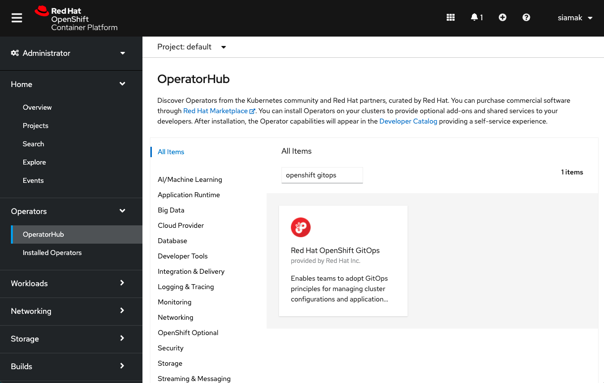

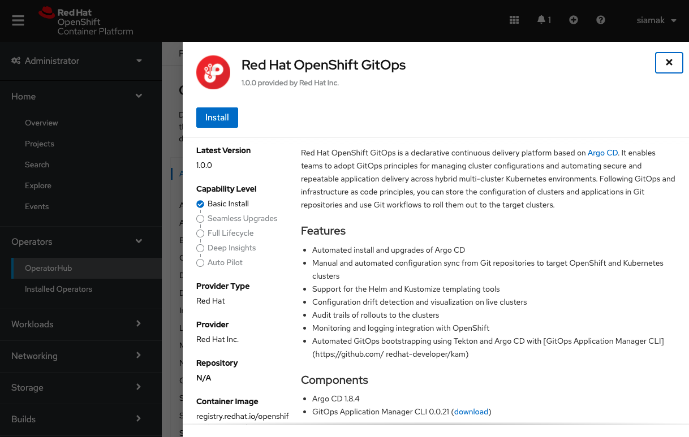

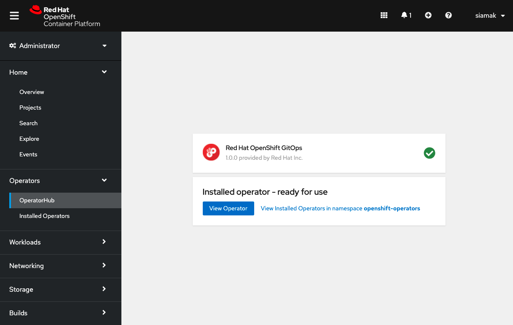

Once OpenShift GitOps is installed, an instance of Argo CD is automatically installed on the cluster in the `openshift-gitops` namespace and link to this instance is added to the application launcher in OpenShift Web Console.

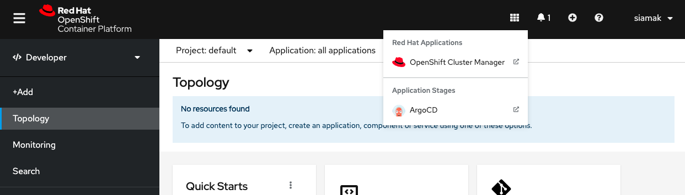

## Log into Argo CD dashboard

Argo CD upon installation generates an initial admin password which is stored in a Kubernetes secret. In order to retrieve this password, run the following command to decrypt the admin password:

```
oc extract secret/openshift-gitops-cluster -n openshift-gitops --to=-
```

Click on Argo CD from the OpenShift Web Console application launcher and then log into Argo CD with `admin` username and the password retrieved from the previous step.

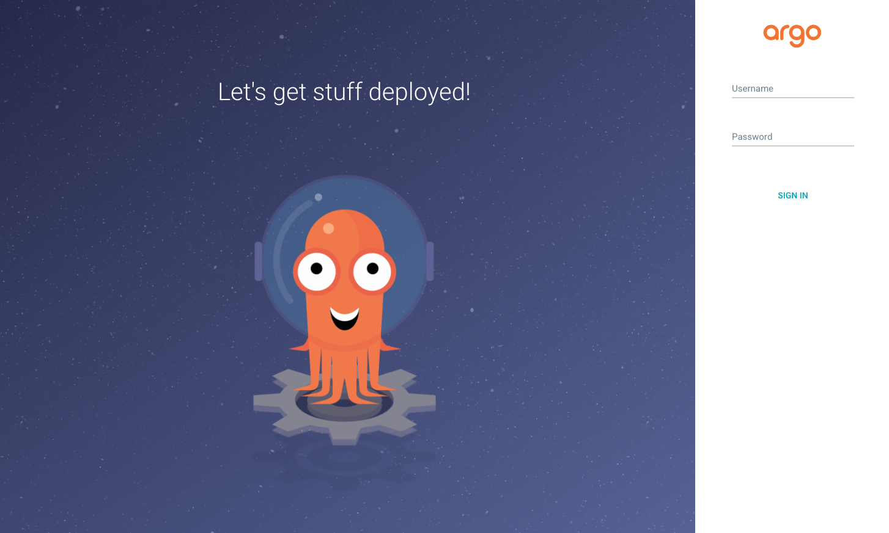

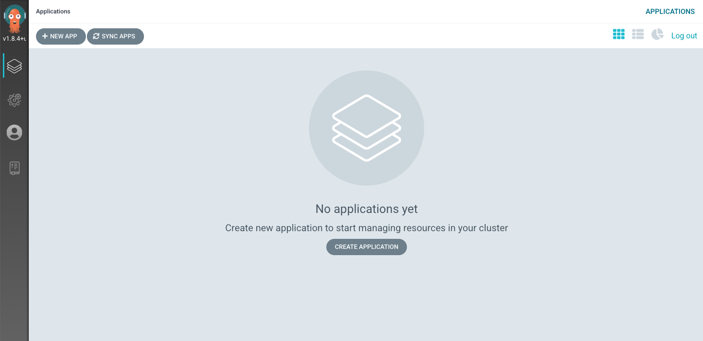


## Configure OpenShift with Argo CD

In the current Git repository, the [cluster](cluster/) directory contains OpenShift cluster configurations such as an OpenShift Web Console customization as well as namespaces that should be created. Let's configure Argo CD to recursively sync the content of the [cluster](cluster/) directory to the OpenShift cluster. Initially, we can set the sync policy to manual in order to be able to review changes before rolling out configurations to the cluster. 

In the Argo CD dashboard, click on the **New App** button to add a new Argo CD application that syncs a Git repository containing cluster configurations with the OpenShift cluster.

Enter the following details and click on **Create**.

* Application Name: `cluster-configs`
* Project: `default`
* Sync Policy: `Manual`
* Repository URL: `https://github.com/siamaksade/openshift-gitops-getting-started`
* Revision: `HEAD`
* Path: `cluster`
* Destination: `https://kubernetes.default.svc`
* Namespace: `default`
* Directory Recurse: `checked`

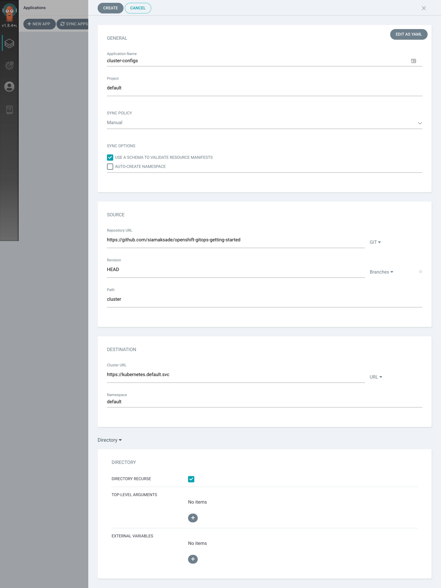

> Argo CD applications can get configured declaratively by creating `Application` resources. As an alternative to the Argo CD dashboard, you can create the **cluster-configs** application by importing the following file:
>  ```
>  oc create -f argo/cluster.yaml
>  ```
> Run the following to review the created application:
>  ```
>  oc get application -n openshift-gitops
>  ```

Looking at the Argo CD dashboard, you would notice that the **cluster-configs** Argo CD application is created by is out of sync, since we configured it with manual sync policy.

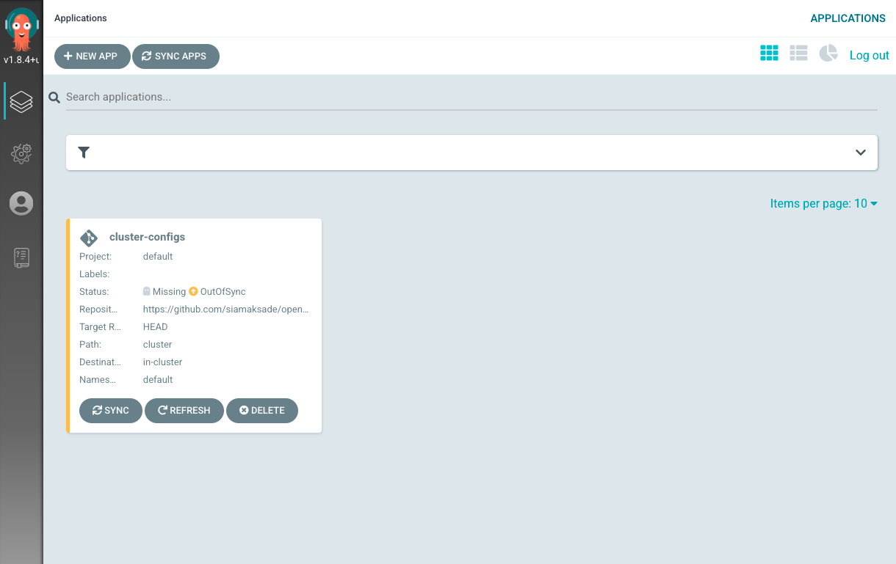

Click on the **Sync** button on the **cluster-configs** application and then on **Synchronize** button after reviewing the changes that will be rolled out to the cluster.

Once the sync is completed successfully, you would see that Argo CD reports a the configurations to be currently in sync with the Git repository and healthy. You can click on the **cluster-configs** application to check the details of sync resources and their status on the cluster. 

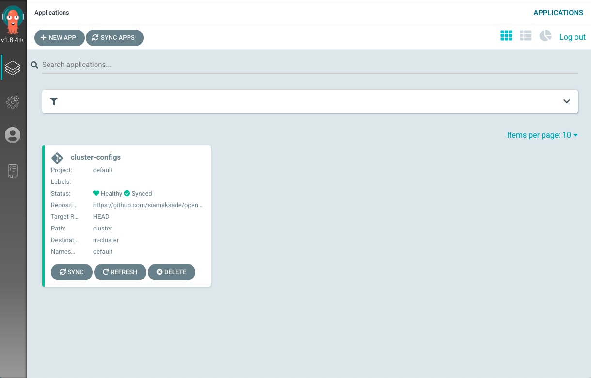

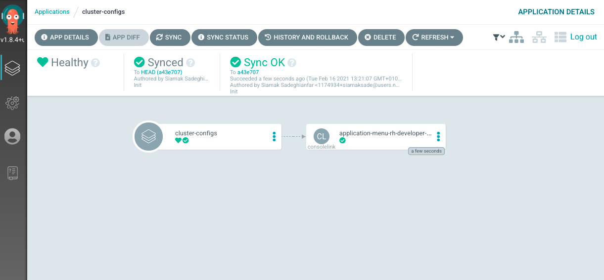

Now go back to the OpenShift Web Console and click on the **Application Launcher**. You would see that a new link is added which points at the [Red Hat Developer Blog](https://developers.redhat.com/topics/kubernetes) as the result of rolling out the content of the [cluster](cluster/) directory to the cluster. If curious, take a look inside the [cluster](cluster/) to find out which config enables adding links to the OpenShift Web Console!

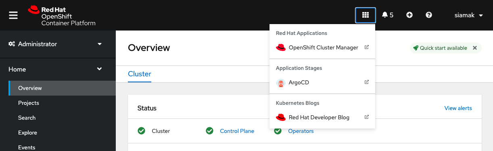

You can also check that a namespace called `spring-petclinic` is created on the cluster.

Now that the configuration sync is in place, any changes in the Git repository will be automatically detect by Argo CD and would change the status of the **cluster-configs** to `OutOfSync`, which implies a drift from the desired configuration. One can set the [sync policy to automated](https://argo-cd.readthedocs.io/en/stable/user-guide/auto_sync/) in order for Argo CD to automatically roll out changes form Git repository to the cluster. 

## Deploy Applications with Argo CD

In addition to configuring OpenShift clusters, many teams use GitOps workflows for continuous delivery and deploying applications in multi-cluster Kubernetes environments.

The [app](app/) directory in the current Git repository contains the Kubernetes manifests using Kustomize for deploying the sample Spring PetClinic application. Let's configure Argo CD to automatically and recursively deploy any changes made to these manifests on the OpenShift cluster in the `spring-petclinic` namespace that was created by Argo CD in the previous step.

In the Argo CD dashboard, click on the **New App** button to add a new Argo CD application that syncs a Git repository containing cluster configurations with the OpenShift cluster.

Create a new Argo CD application by clicking on the **New App** button in the Argo CD dashboard and entering the following details.

* Application Name: `spring-petclinic`
* Project: `default`
* Sync Policy: `Automatic`
* Self-heal: `checked`
* Repository URL: `https://github.com/siamaksade/openshift-gitops-getting-started`
* Revision: `HEAD`
* Path: `app`
* Destination: `https://kubernetes.default.svc`
* Namespace: `spring-petclinic`
* Directory Recurse: `checked`

> You can also create the Argo CD application by importing the following file:
>  ```
>  oc create -f argo/app.yaml
>  ```

Because we set up the sync policy to `Automatic`, as soon as the Argo CD application is created, a sync is started in order to rollout the Spring PetClinic manifests to the `spring-petclinic` namespace.

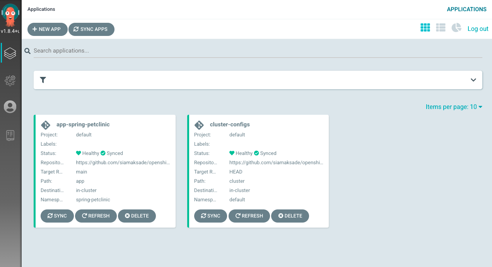

Click on the **app-spring-petclinic** in the Argo CD dashboard to view the application resources that are deployed to the cluster.

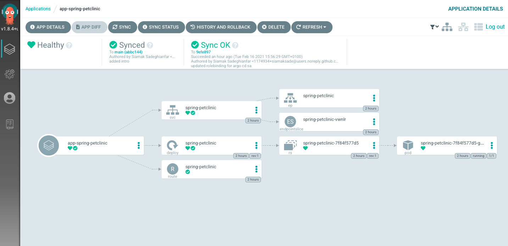

In the OpenShift Web Console, go to the **Developer** perspective to review the deployed application. 

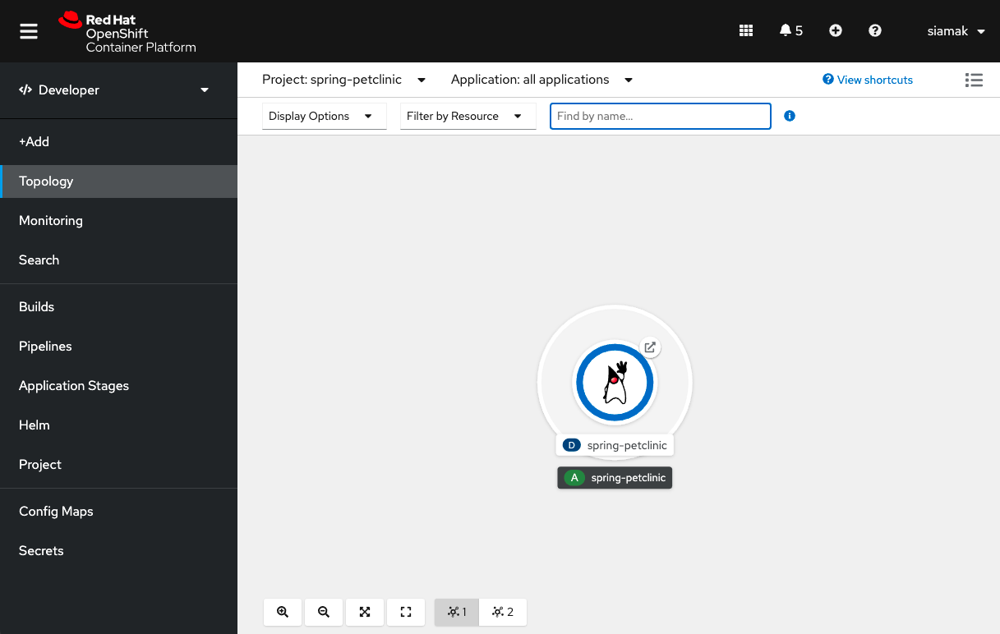

In oder to modify the Spring PetClinic deployment, all the user needs to do is to commit the changes to the [app](app/) directory of the Git repository and the changes would automatically get deployed to the cluster. 

In addition, Argo CD constantly monitors the state of the deployed applications in order to detect drift and automatically correct it in this example, since we configured the Argo CD application with self-healing. Run the following command to modify the deployment on the cluster and scale it up to 2 pods while watching the application in the OpenShift Web Console:

```
oc scale deployment spring-petclinic --replicas 2  -n spring-petclinic
```

You would notice that the deployment momentarily scales up to 2 pods and immediately scales down again to 1 pod as Argo CD detects a drift from the Git repository and auto-heals the application on the OpenShift cluster. This behavior can be controlled by the [Self-heal](https://argo-cd.readthedocs.io/en/stable/user-guide/auto_sync/#automatic-self-healing) setting.

In Argo CD dashboard, click on the **app-spring-petclinic** and then **App Details** &rarr; **Events**. You can see the event details of Argo CD detecting that the deployment resources is out of sync on the cluster and resyncing the Git repository to correct it.

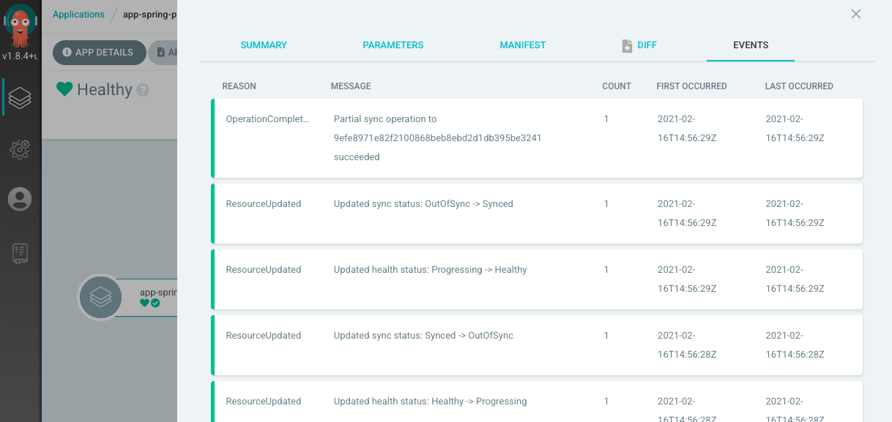


## Additional Argo CD instances

Although OpenShift GitOps by default installs an Argo CD instance for the cluster, there are use-cases where different application teams might need their own Argo CD instance confined to their own namespaces and applications. Therefore, OpenShift GitOps support creating additional Argo CD instances declaratively through creating `ArgoCD` resources. 

In the OpenShift Web Console, create a project called `myargocd` and then click on the plus sign in the top navigation bar. Then, paste the following in the YAML editor, and click on **Create** afterwards:

```
apiVersion: argoproj.io/v1alpha1
kind: ArgoCD
metadata:
  name: myargocd
spec:
  server:
    route:
      enabled: true
```

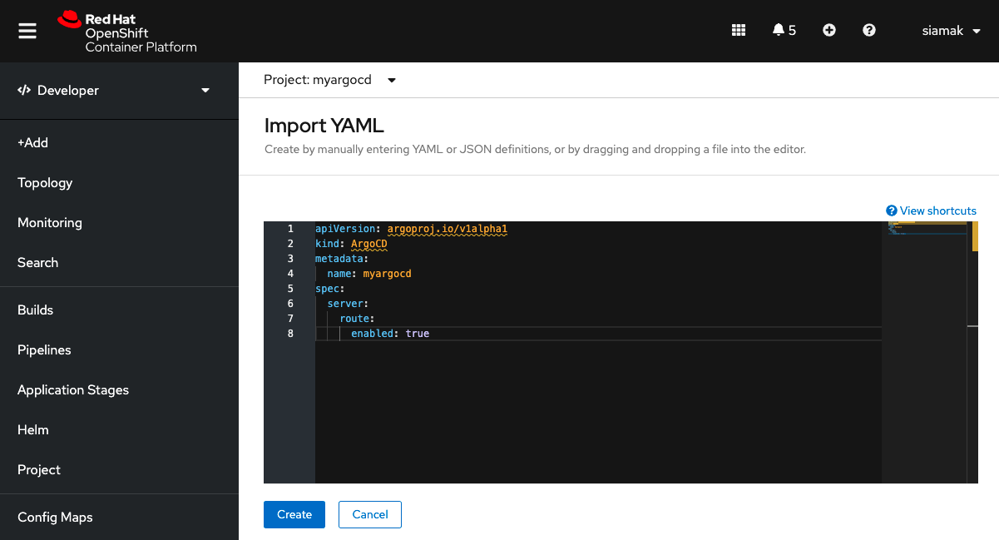

> Alternatively, you can run the following CLI commands:
> ```
> oc new-project myargocd
> oc create -f argo/argocd.yaml
> ```

Click on the **Topology** to view the Argo CD instance deployed in your namespace.

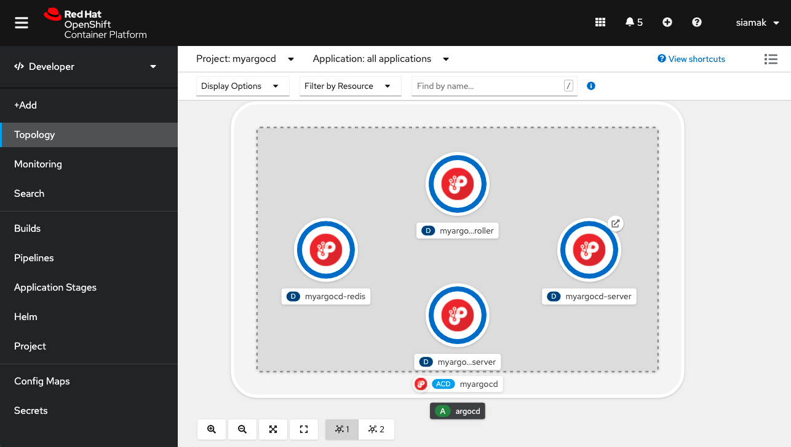

Click on the Argo CD URL to open the Argo CD dashboard. 

As described previously, Argo CD upon installation generates an initial admin password which is stored in a Kubernetes secret called `[argocd-name]-cluster`. Run the following command to decrypt the `admin` password and log into Argo CD dashboard:

```
oc get secret myargocd-cluster -n myargocd -ojsonpath='{.data.admin\.password}' | base64 -d
```

